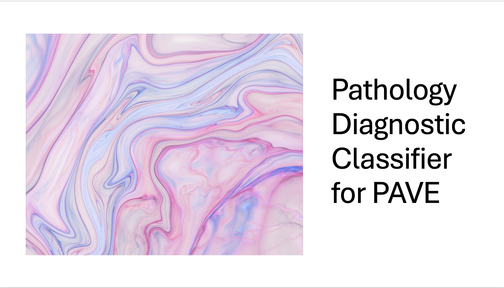
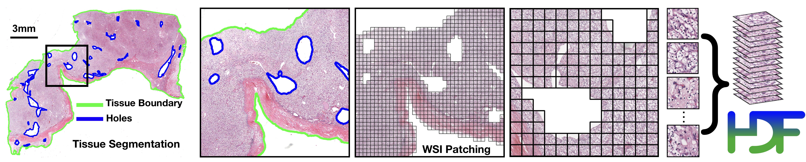

This repository contains scripts and templates for running segmentation and patching, feature extraction, and model training on whole slide images (WSIs) for the PAVE Pathology project. The workflow includes shell scripts designed for SLURM job scheduling. The workflow was designed to run on the Alpine HPC from CU Boulder, hence the default file path structure.

---

## Processing Pipeline

### 1. File Decryption

The hard drives contain the raw .svs WSIs and the DICOM data, as well as an encrypted file viewer software, which is the only way to access these files. **There is no known way to access or manipulate the contents of the drives via the command line**.

The software lacks modern scrolling and selecting functionality, so in order to select a large amount of files, I have found that the best way is to select one file, scroll to the last desired file, hold `Shift+Cmd`, and _drag_ up/down to that last desired file. The `Cmd` key works to select multiple discontigious files, but _only when you drag to select/unselect a few_. If you simply select one, hold `Shift`, and select another, it unselects.

It is recommended to select as the decryption destination directory a remote mount (via `sshfs`) of the target directory on the desired server.

The only two hard drives we currently have are `navyblue` and `pv3`, so the following documentation is phrased in terms of these two drives. We are expecting to receive at least one more.

It is _vital_ to run `remove_unconsented.sh` to ensure that all the WSIs corresponding to unconsenting patients are deleted any server to which the raw images are decrypted.

### 2. Batching

**Goal:** Spilt the WSI files from each drive into subdirectories of 300 for parallel processing, generating the following file structure:

```
navyblue/
   ├── A
      └── wsis
         ├── PATH000000001.svs
         ├── PATH000000002.svs
         ├── ...
         └── PATH000000300.svs
   ├── B
      └── wsis
         ├── PATH000000301.svs
         ├── PATH000000302.svs
         ├── ...
         └── PATH000000600.svs
   ├── C
      └── wsis
         ├── PATH000000601.svs
         ├── PATH000000602.svs
         ├── ...
         └── PATH000000900.svs
   └── ...
```

**Script:** `fill_directories.sh`

-  Usage:
   ```
   source fill_directories.sh BASE_DIR
   ```
-  This shell script iterates through the lettered subdirectories of `BASE_DIR` (i.e. `navyblue` or `pv3`), and distributes the loose .svs files among them, ensuring that as long as there are loose files to distribute, [A-Z]/wsis/ has 300 WSIs.
-  Note: It does not create new lettered subdirectories when they are needed, this, as of now, is done manually.

### 3. Segmentation and Patching

**Goal:** Segment the tissue from the WSI and generate masks, patches, and stitched representations of the patched WSIs, for feature extraction.



**Script:** `patch_template.sh`

-  SLURM batch script to extract features from a specified directory (e.g., `navyblue/A`, `pv3/B`, etc).
-  Loads the appropriate conda environment and runs `create_patches_fp.py` with the correct arguments.
-  Additionally executes `gen_pre_feat_ext_csv.py` for CSV processing.
-  Example usage:

**Batch Submission:**

To process all subdirectories (e.g., all lettered folders in a dataset), use:

-  `patch_navyblue.sh` for the `navyblue` dataset.
-  `patch_pv3.sh` for the `pv3` dataset.

These scripts loop through all lettered subdirectories and submit a feature extraction job using `patch_template.sh` for each.

**Results:**

The execution of `create_patches_fp.py` and `gen_pre_feat_ext_csv.py`, as facilitated by the above shell scripts, leads to the following file structure in each lettered subdirectory:

```
navyblue/
   ├── A
      ├── wsis
         └── ...
      ├── masks
         ├── PATH000000001.png
         ├── ...
         └── PATH000000300.png
      ├── patches
         ├── PATH000000001.h5
         ├── ...
         └── PATH000000300.h5
      ├── stitches
         ├── PATH000000001.png
         ├── ...
         └── PATH000000300.png
      ├── process_list_autogen.csv
      └── pre_feat_ext.csv

   └── ...
```

`pre_feat_ext.csv` is then for use during feature extraction.

### 4. Feature Extraction

**Goal:** Extract patch-level features for each WSI using a pretrained model. In our case, we use [UNI](https://github.com/mahmoodlab/UNI), a pathology foundation model from the Mahmood Lab.

**Script:** `feat_ext_template.sh`

-  SLURM batch script to extract features from a specified directory.
-  Loads the appropriate conda environment and runs `extract_features_fp.py` with the correct arguments.

**Batch Submission:**

To process all subdirectories (e.g., all lettered folders in a dataset), use:

-  `feat_ext_navyblue.sh` for the `navyblue` dataset
-  `feat_ext_pv3.sh` for the `pv3` dataset

These scripts loop through all subdirectories and submit a feature extraction job using `feat_ext_template.sh` for each.

**Results**

The script stores features both on their own as `.pt` files and embedding in the representation of patches in HDF5 files (`.h5`), resulting in the following file structure in each lettered subdirectory:

```
navyblue/
   ├── A
      ├── wsis
         └── ...
      ├── masks
         └── ...
      ├── patches
         └── ...
      ├── stitches
         └── ...

      ├── pt_files
         ├── PATH000000001.pt
         ├── ...
         └── PATH000000300.pt
      ├── h5_files
         ├── PATH000000001.h5
         ├── ...
         └── PATH000000300.h5

      ├── process_list_autogen.csv
      ├── pre_feat_ext.csv
      └── post_feat_ext.csv
   └── ...
```

### Symlinking

In order to gather all the files (.svs, .pt, .h5) from their batched lettered subdirectories into a consolidated representation for training and heatmap generation, it is necessary to execute `symlink_files.py`.

Again, default file paths shold be adapted for use outside of the Alpine HPC. However, it worth nothing that since the scripts to create spilts, train, and evaluate accept a DATA_ROOT_DIR with nested directories representing potentially distinct datasets, the following file structure is necessary:

```
DATA_ROOT_DIR (pave_training)
   ├── DATASET_1_DATA_DIR (pathology_features, specified within the task parsing in splitting, training, and evaluation scripts)
      ├── wsis
         ├── slide_1.svs
         ├── slide_2.svs
         └── ...
      ├── h5_files
         ├── slide_1.h5
         ├── slide_2.h5
         └── ...
      └── pt_files
         ├── slide_1.pt
         ├── slide_2.pt
         └── ...

   ├──DATASET_2_DATA_DIR/
      └── ...
   └── ...
```

### 5. Model Training

**Goal:** Train models for a specific task on the extracted features.

In `main.py`, the training script, there is a section responsible for configuring the data and labels and training logic for a specific task.

The tasks specified for this project include:

-  `pathology_full_subtyping`, trained on all 5 labels: insufficient, normal, low_grade, high_grade, cancer.
-  `pathology_sufficiency`, binary classifier, sufficient or insufficient.
-  `pathology_normalcy`, binary classifier, normal or abnormal.

The CSVs containing labels and slide IDs for each task are under `dataset_csv`, and are generated by `merge_csvs.ipynb`.

**Script:** `train_template.sh`

-  SLURM batch script is used to train a model on a given task with a given set of hyperparameters.
-  The arguments to this script are the same as the arguments to main.py itself, i.e., one could replace `sbatch train_template.sh` with `python main.py` (with a few desired defaults, e.g. --weighted_sample --early_stopping --log_data)

Example usage:

```
sbatch train_template.sh --task pathology_normalcy --exp_code normalcy_pos --model_type clam_sb --data_root_dir /scratch/alpine/$USER/pave_training

sbatch train_template.sh --task pathology_sufficiency --exp_code sufficiency_pos --model_type clam_sb --data_root_dir /scratch/alpine/$USER/pave_training

sbatch train_template.sh --task pathology_full_subtyping --exp_code full_subtyping_pos --data_root_dir /scratch/alpine/$USER/pave_training --use_pos_embed
```
